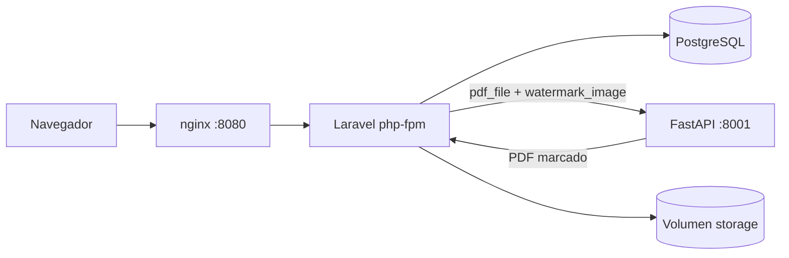

# Gestor de contratos con watermark


Sistema para subir contratos en PDF, aplicarles una watermark y administrarlos
por usuario.

Son dos aplicaciones separadas que se comunican por HTTP. Laravel se encarga de
sesiones, base de datos y archivos; el servicio en Python solo marca PDFs y no
sabe nada del resto del sistema.

## Cómo levantarlo

```bash
git clone https://github.com/Xhinhoy/bolsa-productos-prueba.git
cd bolsa-productos-prueba
docker compose up -d --build
```

Con eso queda andando en http://localhost:8080. No hay que configurar nada
antes: al arrancar, el contenedor de Laravel genera la clave de aplicación,
corre las migraciones y crea los usuarios de prueba.

Si tu Docker es antiguo, `docker-compose up -d --build` hace lo mismo.

## Usuarios

| Correo | Contraseña |
|---|---|
| carlos.morales@bolsa.test | password123 |
| luis.carrasco@bolsa.test | password123 |
| angerly.rojas@bolsa.test | password123 |

No hay pantalla de registro. La ruta directamente no existe.

## Cómo está armado



El registro de un documento pasa por: validar el formulario, mandar los dos
archivos al servicio Python, recibir el PDF ya marcado, escribirlo en disco y
recién entonces insertar la fila. Si algo falla en el camino borro el archivo,
para no dejar huérfanos en el volumen.

La llamada HTTP queda fuera de cualquier transacción. Con un timeout de 60
segundos, mantenerla abierta significaría bloquear filas en Postgres todo ese
rato.

Los archivos van a `storage/app/private/documents/{user_id}/{ulid}.pdf`, fuera
del web root, y solo salen por el controlador de descarga después de comprobar
la policy. El nombre original del usuario nunca toca el disco: se guarda en la
base de datos y se usa en la cabecera `Content-Disposition`.

## Versiones

| | |
|---|---|
| Laravel | 12 |
| PHP | 8.4, php-fpm sobre alpine |
| PostgreSQL | 16 |
| Python | 3.13 |
| FastAPI / Uvicorn | 0.115 / 0.32 |
| pypdf / reportlab / Pillow | 5 / 4 / 11 |
| nginx | 1.27 |

## Rutas

Todo lo que no sea el login exige sesión.

| Método | Ruta | Qué hace |
|---|---|---|
| GET | `/login` | Formulario |
| POST | `/login` | Autentica. Limitado a 5 intentos por minuto |
| POST | `/logout` | Cierra sesión |
| GET | `/documents` | Listado propio, 10 por página, más reciente primero |
| GET | `/documents/create` | Formulario de registro |
| POST | `/documents` | Marca y guarda. Limitado a 20 por minuto |
| GET | `/documents/{id}/download` | Entrega el PDF marcado |
| DELETE | `/documents/{id}` | Borra fila y archivo |

El servicio de marcado expone lo suyo en el puerto 8001: `GET /health` para el
healthcheck de Docker y `POST /watermark`, que recibe `pdf_file` y
`watermark_image` y devuelve el PDF marcado.

Ante un error, `/watermark` responde `{"code": "...", "message": "..."}`.
Laravel propaga ese mensaje al usuario cuando es un 4xx, porque habla de su
archivo; ante un 5xx muestra uno genérico.

## Variables de entorno

Todas están definidas en `docker-compose.yml` con valores que funcionan tal cual.

Servicio de marcado:

| Variable | Default | Para qué |
|---|---|---|
| `WATERMARK_OPACITY` | `0.25` | Opacidad de la marca, de 0 a 1 |
| `WATERMARK_SCALE` | `0.5` | Ancho de la marca como fracción del ancho de página |
| `MAX_PDF_MB` | `10` | Tope de tamaño del PDF |
| `MAX_IMAGE_MB` | `2` | Tope de tamaño de la imagen |
| `MAX_PAGES` | `500` | Tope de páginas, para PDFs bomba |

Laravel:

| Variable | Default | Para qué |
|---|---|---|
| `WATERMARK_URL` | `http://watermark:8001` | Dónde vive el servicio |
| `WATERMARK_TIMEOUT` | `60` | Segundos de espera del marcado |
| `APP_DEBUG` | `false` | Nunca en `true` en la entrega |
| `LOG_CHANNEL` | `stderr` | Para que los logs salgan por `docker compose logs` |

Los límites de subida están alineados en las tres capas: nginx en 12M, PHP en
12M de `upload_max_filesize` y 24M de `post_max_size`, y Laravel en 10240 KB.
Con el default de 1M de nginx, la validación de Laravel no llegaría a
ejecutarse nunca: nginx cortaría antes con un 413.

## Tests

```bash
make test
```

O por separado:

```bash
docker build --target test -t app-test ./app && docker run --rm app-test
docker build --target test -t wm-test ./watermark-service && \
  docker run --rm wm-test sh -c "ruff check . && mypy app && python -m pytest -q"
```

Del lado de Laravel son 9 tests con `Http::fake()` y `Storage::fake()`. Los que
más me interesaban eran los dos que comprueban que un fallo del servicio Python,
tanto un 500 como una conexión rechazada, no deja ni fila ni archivo. Es la
única forma de saber que no se van acumulando huérfanos.

Del lado de Python son otros 9 con pytest. El PDF de prueba se genera en memoria
con reportlab, así que no hay binarios en el repositorio. Ahí el test importante
es el que cuenta los XObjects de imagen por página, porque que el PDF resultante
parsee no prueba que se le haya marcado nada.

El análisis estático corre con `make lint`: Pint y Larastan nivel 6 en PHP, ruff
y mypy en Python. Los cuatro están en el CI.

## Seguridad

- CSRF en todos los formularios
- Middleware `auth` en toda ruta de documentos
- Policy comprobada en descarga y eliminación, y además el listado filtra por la
  relación del usuario. Son dos capas independientes: si un refactor rompe una,
  la fuga igual no ocurre
- Archivos fuera del web root, servidos solo por el controlador
- Nombres de archivo generados con ULID, nunca el del usuario
- `user_id` no está en `$fillable`; el dueño lo pone la relación
- Validación de MIME por contenido (`mimetypes`) además de por extensión
  (`mimes`). Solo con `mimes` pasa un `.exe` renombrado a `.pdf`
- Topes de tamaño y de páginas en el servicio de marcado
- Throttling en login y en la ruta de subida
- `APP_DEBUG=false` y ningún secreto en el repositorio
- Los procesos de PHP y del servicio Python corren sin root

## Decisiones y supuestos

**La columna Estado.** Acá me quedé un rato pensando. El enunciado pide una
columna con valores "Procesado" y "Error", pero el flujo dice que si el marcado
falla el documento no se registra. En un procesamiento síncrono esas dos cosas
no pueden convivir, porque una fila con estado "Error" nunca alcanzaría a
existir. Dejé el enum en el esquema, que es donde tendría sentido si el marcado
se moviera a una cola, pero hoy solo se persisten filas `processed` y los
fallos se muestran como mensaje flash.

**"DataTable".** Lo leí como tabla paginada en servidor, no como la librería de
jQuery del mismo nombre. El documento usa esa misma tipografía para `Registro`,
`Listado` y `Controller`, que tampoco son paquetes. Una tabla Blade con
`paginate(10)` cubre listado, orden y paginación sin sumar jQuery, DataTables,
su CSS y un endpoint AJAX aparte para diez filas por página.

**pypdf y no PyMuPDF.** PyMuPDF es bastante más rápido, pero su licencia es
AGPL, y en un producto interno eso obliga a liberar el código. Preferí pypdf con
reportlab aunque diera más trabajo.

**Breeze.** No lo usé. Traía registro, recuperación de contraseña, verificación
de correo y perfil, y el enunciado prohíbe el registro. Sacar todo eso era más
trabajo que escribir las cuarenta líneas del login.

Otras cosas más chicas, en desorden. El tamaño que muestro es el del PDF marcado
y no el del original, porque es el que el usuario termina descargando, aunque
guardo los dos. La opacidad y la escala de la marca no venían especificadas, así
que quedaron configurables por variable de entorno en 0.25 y 0.5. La
transparencia la horneo en el canal alfa de la imagen con Pillow en vez de usar
el graphics-state del PDF, porque hay visores que lo ignoran y se veía distinto
según con qué lo abrieras. El endpoint de marcado es `def` y no `async def`: el
trabajo es CPU-bound y bloqueante, y Starlette manda los endpoints síncronos a
su threadpool, así que con `async def` se congelaría el event loop. Y solo
reintento la llamada cuando falla la conexión, nunca ante un 4xx, porque un PDF
corrupto va a seguir corrupto en el tercer intento.

Sobre Docker: no uso bind mounts. El código se copia dentro de la imagen y las
dependencias se instalan en el build, para no arrastrar los problemas de
permisos y rendimiento que dan los mounts en Windows y para que nadie tenga que
correr `composer install` en su máquina. La clave de aplicación se genera en el
primer arranque y queda en el volumen de storage, así no hay secretos en el
repositorio y las sesiones sobreviven a un reinicio.

Dos limitaciones conocidas. Si la validación falla, el nombre del contrato
vuelve al formulario pero los archivos hay que volver a elegirlos: los
navegadores no permiten repoblar un input de tipo file y no hay forma de
arreglarlo desde el servidor. Y `page_count` queda en `null`, porque el servicio
de marcado todavía no devuelve el conteo de páginas.

## Si algo no arranca

**El puerto 8080 está ocupado.** Cambia el mapeo de `nginx` en
`docker-compose.yml` a algo como `8090:80`.

**"permission denied" contra el socket de Docker.** Falta el grupo:
`sudo usermod -aG docker $USER` y volver a iniciar sesión.

**Quiero empezar de cero.** `make fresh` borra los volúmenes y reconstruye. Eso
se lleva la base de datos y los archivos subidos.

**La primera construcción tarda.** Son cuatro imágenes y la compilación de las
extensiones de PHP. Cinco minutos con la caché fría es normal.

## Qué haría con más tiempo

Lo primero, mover el marcado a una cola. Ahí la columna Estado tendría sentido
completo: la fila se crearía en `processing`, pasaría a `processed` o a `failed`
y el usuario no quedaría esperando con el formulario bloqueado.

Después, en orden: guardar los archivos en S3 en lugar del volumen local, URLs
de descarga firmadas y temporales, límite de subidas por usuario y no solo por
IP, y trazas con OpenTelemetry para ver cuánto del tiempo de respuesta se va en
el servicio de marcado.
