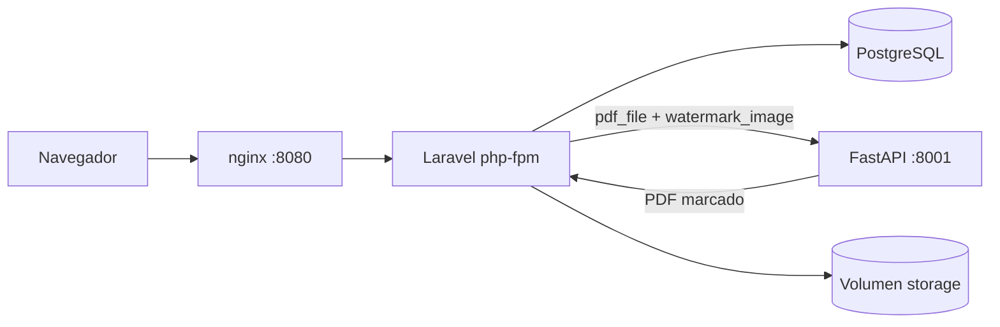

# Gestor de contratos con marca de agua


Sistema para subir contratos en PDF, aplicarles una marca de agua y
administrarlos por usuario.

Son dos aplicaciones separadas que se comunican por HTTP. Laravel se encarga de
sesiones, base de datos y archivos; el servicio en Python solo marca PDFs y no
sabe nada del resto del sistema.

## Cómo levantarlo

```bash
git clone https://github.com/Xhinhoy/bolsa-productos-prueba.git
cd bolsa-productos-prueba
docker compose up -d --build
```

Con eso queda andando en http://localhost:8080. No hay que configurar nada
antes: al arrancar, el contenedor de Laravel genera la clave de aplicación,
corre las migraciones y crea los usuarios de prueba.

Si tu Docker es antiguo, `docker-compose up -d --build` hace lo mismo.

## Usuarios

| Correo | Contraseña |
|---|---|
| carlos.morales@bolsa.test | password123 |
| luis.carrasco@bolsa.test | password123 |
| angerly.rojas@bolsa.test | password123 |

No hay pantalla de registro. Ni siquiera existe la ruta.

## Cómo está armado



El registro de un documento pasa por: validar el formulario, mandar los dos
archivos al servicio Python, recibir el PDF ya marcado, escribirlo en disco y
recién entonces insertar la fila. Si algo falla en el camino borro el archivo,
para no dejar archivos sueltos que ninguna fila referencie.

La llamada HTTP queda fuera de cualquier transacción de base de datos. Con un
tiempo de espera de 60 segundos, mantenerla abierta significaría dejar filas
bloqueadas en Postgres todo ese rato.

Los archivos van a `storage/app/private/documents/{user_id}/{ulid}.pdf`, que
está fuera del directorio público del servidor, así que nadie puede pedirlos por
URL directa. Solo salen por el controlador de descarga y después de comprobar
los permisos. El nombre original del archivo del usuario nunca toca el disco: se
guarda en la base de datos y se usa al momento de la descarga, en la cabecera
`Content-Disposition`.

## Versiones

| | |
|---|---|
| Laravel | 12 |
| PHP | 8.4, php-fpm sobre alpine |
| PostgreSQL | 16 |
| Python | 3.13 |
| FastAPI / Uvicorn | 0.115 / 0.32 |
| pypdf / reportlab / Pillow | 5 / 4 / 11 |
| nginx | 1.27 |

## Rutas

Todo lo que no sea el login exige sesión.

| Método | Ruta | Qué hace |
|---|---|---|
| GET | `/login` | Formulario |
| POST | `/login` | Autentica. Limitado a 5 intentos por minuto |
| POST | `/logout` | Cierra sesión |
| GET | `/documents` | Listado propio, 10 por página, más reciente primero |
| GET | `/documents/create` | Formulario de registro |
| POST | `/documents` | Marca y guarda. Limitado a 20 por minuto |
| GET | `/documents/{id}/download` | Entrega el PDF marcado |
| DELETE | `/documents/{id}` | Borra fila y archivo |

El servicio de marcado expone dos rutas en el puerto 8001. `GET /health`
responde si el servicio está vivo, y es lo que Docker consulta para saber si el
contenedor ya está listo. `POST /watermark` recibe `pdf_file` y
`watermark_image` y devuelve el PDF marcado.

Ante un error, `/watermark` responde `{"code": "...", "message": "..."}`.
Laravel le muestra ese mensaje al usuario cuando el código es 4xx, porque habla
de su archivo; si es 5xx muestra uno genérico, porque el problema es nuestro.

## Variables de entorno

Todas están definidas en `docker-compose.yml` con valores que funcionan tal cual.

Servicio de marcado:

| Variable | Por defecto | Para qué |
|---|---|---|
| `WATERMARK_OPACITY` | `0.25` | Opacidad de la marca, de 0 a 1 |
| `WATERMARK_SCALE` | `0.5` | Ancho de la marca, como fracción del ancho de página |
| `MAX_PDF_MB` | `10` | Tope de tamaño del PDF |
| `MAX_IMAGE_MB` | `2` | Tope de tamaño de la imagen |
| `MAX_PAGES` | `500` | Tope de páginas |

El tope de páginas existe porque un PDF de pocos kilobytes puede declarar
cientos de miles de páginas y dejar sin memoria al servicio que intente
procesarlas.

Laravel:

| Variable | Por defecto | Para qué |
|---|---|---|
| `WATERMARK_URL` | `http://watermark:8001` | Dónde vive el servicio |
| `WATERMARK_TIMEOUT` | `60` | Segundos de espera del marcado |
| `APP_DEBUG` | `false` | Nunca en `true` en la entrega |
| `LOG_CHANNEL` | `stderr` | Manda los registros a la salida del contenedor, para verlos con `docker compose logs` |

Los límites de subida están alineados en las tres capas por las que pasa un
archivo: nginx en 12M, PHP en 12M de `upload_max_filesize` y 24M de
`post_max_size`, y Laravel en 10240 KB. Si nginx se quedara en su valor por
defecto de 1M, cortaría la subida antes con un error 413 y la validación de
Laravel nunca llegaría a ejecutarse, así que el usuario vería una página de
error del servidor en lugar del mensaje que preparé.

## Tests

```bash
make test
```

O por separado:

```bash
docker build --target test -t app-test ./app && docker run --rm app-test
docker build --target test -t wm-test ./watermark-service && \
  docker run --rm wm-test sh -c "ruff check . && mypy app && python -m pytest -q"
```

Del lado de Laravel son 9 tests, con el cliente HTTP y el disco de archivos
simulados. Los que más me interesaban eran los dos que comprueban que un fallo
del servicio Python, tanto un error 500 como una conexión rechazada, no deja ni
fila en la base ni archivo en disco. Sin eso no tendría cómo saber si se van
acumulando archivos sueltos.

Del lado de Python son otros 9 con pytest. El PDF de prueba se genera en memoria
con reportlab, así que no hay archivos binarios en el repositorio. Ahí el test
importante es el que cuenta, página por página, los objetos de imagen que
quedaron incrustados en el PDF: que el archivo resultante se abra sin errores no
prueba que se le haya marcado nada.

El análisis estático corre con `make lint`: Pint y Larastan nivel 6 en PHP, ruff
y mypy en Python. Los cuatro se ejecutan también en cada subida al repositorio.

## Seguridad

- Todos los formularios llevan token CSRF
- Ninguna ruta de documentos es accesible sin sesión iniciada
- Antes de descargar o eliminar se comprueba que el documento sea del usuario
  que lo pide, y además el listado solo consulta los suyos. Son dos capas
  independientes: si un cambio futuro rompe una, la fuga igual no ocurre
- Los archivos quedan fuera del directorio público y solo salen por el
  controlador
- Los nombres de archivo en disco son identificadores generados, nunca el nombre
  que subió el usuario
- El dueño del documento lo define la relación en base de datos y no un campo
  del formulario, así nadie puede apropiarse de un documento ajeno alterando la
  petición
- El tipo de archivo se valida por su contenido real y no solo por la extensión.
  Validando solo la extensión, un ejecutable renombrado a `.pdf` pasaría
- Hay topes de tamaño y de cantidad de páginas en el servicio de marcado
- El login está limitado a 5 intentos por minuto y la subida a 20
- `APP_DEBUG=false`, así que un error nunca muestra rutas internas ni trazas
- Ningún secreto está guardado en el repositorio
- Los procesos de PHP y del servicio Python corren sin privilegios de root

## Decisiones y supuestos

**La columna Estado.** Acá me quedé un rato pensando. El enunciado pide una
columna con valores "Procesado" y "Error", pero el flujo dice que si el marcado
falla el documento no se registra. En un procesamiento síncrono esas dos cosas
no pueden convivir, porque una fila con estado "Error" nunca alcanzaría a
existir. Dejé el campo en el esquema, que es donde tendría sentido si el marcado
se moviera a una cola de trabajos en segundo plano, pero hoy solo se guardan
filas procesadas y los fallos se muestran como aviso en pantalla.

**"DataTable".** Lo leí como tabla paginada, resuelta en el servidor, y no como
la librería de jQuery del mismo nombre. El documento usa esa misma tipografía
para `Registro`, `Listado` y `Controller`, que tampoco son paquetes. Una tabla
Blade con `paginate(10)` cubre listado, orden y paginación sin sumar jQuery,
DataTables, su hoja de estilos y una ruta adicional para pedir los datos, todo
para mostrar diez filas por página.

**pypdf y no PyMuPDF.** PyMuPDF es bastante más rápido, pero su licencia es
AGPL, y en un producto interno eso obliga a liberar el código fuente. Preferí
pypdf con reportlab aunque diera más trabajo.

**Breeze.** No lo usé. Traía registro, recuperación de contraseña, verificación
de correo y perfil, y el enunciado prohíbe el registro. Sacar todo eso era más
trabajo que escribir las cuarenta líneas del login.

Otras decisiones menores. El tamaño que muestro en el listado es el del PDF ya
marcado y no el del original, porque es el que el usuario termina descargando,
aunque guardo los dos. La opacidad y la escala de la marca no venían
especificadas en el enunciado, así que quedaron configurables por variable de
entorno, en 0.25 y 0.5.

La transparencia la aplico modificando los píxeles de la imagen con Pillow antes
de dibujarla. La alternativa era declarar la transparencia dentro del PDF y
dejar que cada visor la resolviera al mostrarlo, pero varios la ignoran y la
marca se veía distinta según con qué programa se abriera el archivo.

El endpoint de marcado está declarado como función normal y no como función
asíncrona. Marcar un PDF ocupa el procesador y bloquea mientras dura, y FastAPI
ejecuta las funciones normales en hilos aparte, así que el servidor sigue
atendiendo el resto de las peticiones. Declarada asíncrona bloquearía el hilo
principal y el servicio dejaría de responder, incluida la ruta de estado que
Docker consulta.

Los reintentos hacia el servicio de marcado ocurren solo cuando falla la
conexión, nunca cuando responde con un error 4xx. Reintentar un archivo que el
servicio ya rechazó por inválido solo triplica la espera del usuario para llegar
al mismo resultado.

Sobre Docker: el código se copia dentro de la imagen y las dependencias se
instalan al construirla, en lugar de montar la carpeta del proyecto desde el
disco del anfitrión. Montarla trae problemas de permisos y de rendimiento en
Windows, y obligaría a quien evalúe a instalar las dependencias en su propia
máquina antes de levantar nada. La clave de aplicación se genera en el primer
arranque y queda guardada en el volumen de datos, así no hay secretos en el
repositorio y las sesiones abiertas sobreviven a un reinicio.

Dos limitaciones conocidas. Si la validación falla, el nombre del contrato
vuelve al formulario pero los archivos hay que volver a elegirlos: por seguridad
los navegadores no permiten rellenar un campo de tipo archivo desde el servidor.
Y el conteo de páginas queda vacío en la base de datos, porque el servicio de
marcado todavía no lo devuelve.

## Si algo no arranca

**El puerto 8080 está ocupado.** Cambia el mapeo de `nginx` en
`docker-compose.yml` a algo como `8090:80`.

**"permission denied" contra el socket de Docker.** Falta agregar tu usuario al
grupo: `sudo usermod -aG docker $USER` y volver a iniciar sesión.

**Quiero empezar de cero.** `make fresh` borra los volúmenes y reconstruye. Eso
se lleva la base de datos y los archivos subidos.

**La primera construcción tarda.** Son cuatro imágenes y la compilación de las
extensiones de PHP. Cinco minutos la primera vez es normal.

## Qué haría con más tiempo

Lo primero, mover el marcado a una cola de trabajos en segundo plano. Ahí la
columna Estado tendría sentido completo: la fila se crearía en "procesando",
pasaría a "procesado" o a "error", y el usuario no quedaría esperando con el
formulario bloqueado.

Después, en orden: guardar los archivos en S3 en lugar del volumen local,
entregar las descargas por enlaces firmados que caduquen, limitar las subidas
por usuario y no solo por dirección IP, y agregar trazas con OpenTelemetry para
ver cuánto del tiempo de respuesta se va en el servicio de marcado.
