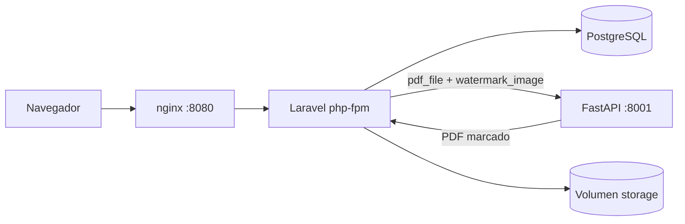

# Gestor de contratos con watermark


Sistema para subir contratos en PDF, estamparles una watermark y
administrarlos por usuario.

Son dos aplicaciones separadas que se comunican por HTTP. Laravel se encarga de
sesiones, base de datos y archivos; el servicio en Python solo marca PDFs y no
sabe nada del resto del sistema.

## Como levantarlo

```bash
git clone https://github.com/Xhinhoy/bolsa-productos-prueba.git
cd bolsa-productos-prueba
docker compose up -d --build
```

Y listo, http://localhost:8080. No hay pasos previos: al arrancar, el contenedor
de Laravel genera la clave de aplicacion, corre las migraciones y crea los
usuarios de prueba.

Si tu Docker es antiguo, `docker-compose up -d --build` hace lo mismo.

## Usuarios

| Correo | Contrasena |
|---|---|
| carlos.morales@bolsa.test | password123 |
| luis.carrasco@bolsa.test | password123 |
| angerly.rojas@bolsa.test | password123 |

No hay pantalla de registro. La ruta directamente no existe.

## Como esta armado



El flujo de registro es: valido el formulario, mando los dos archivos al
servicio Python, recibo el PDF ya marcado, lo escribo en disco y recien
entonces inserto la fila. Si algo falla en el camino borro el archivo, para no
dejar huerfanos en el volumen.

La llamada HTTP ocurre fuera de cualquier transaccion. Con un timeout de 60
segundos, mantener una transaccion abierta significaria bloquear filas en
Postgres todo ese rato.

Los archivos se guardan en `storage/app/private/documents/{user_id}/{ulid}.pdf`,
fuera del web root, y solo salen por el controlador de descarga previa
comprobacion de la policy. El nombre original del usuario nunca toca el disco:
va a la base de datos y se usa en la cabecera `Content-Disposition`.

## Versiones

| | |
|---|---|
| Laravel | 12 |
| PHP | 8.4, php-fpm sobre alpine |
| PostgreSQL | 16 |
| Python | 3.13 |
| FastAPI / Uvicorn | 0.115 / 0.32 |
| pypdf / reportlab / Pillow | 5 / 4 / 11 |
| nginx | 1.27 |

## Rutas

Todo lo que no sea el login exige sesion.

| Metodo | Ruta | Que hace |
|---|---|---|
| GET | `/login` | Formulario |
| POST | `/login` | Autentica. Limitado a 5 intentos por minuto |
| POST | `/logout` | Cierra sesion |
| GET | `/documents` | Listado propio, 10 por pagina, mas reciente primero |
| GET | `/documents/create` | Formulario de registro |
| POST | `/documents` | Marca y guarda. Limitado a 20 por minuto |
| GET | `/documents/{id}/download` | Entrega el PDF marcado |
| DELETE | `/documents/{id}` | Borra fila y archivo |

El servicio de marcado expone dos rutas propias, en el puerto 8001:

| Metodo | Ruta | Que hace |
|---|---|---|
| GET | `/health` | Para el healthcheck de Docker |
| POST | `/watermark` | Recibe `pdf_file` y `watermark_image`, devuelve el PDF marcado |

Ante un error, `/watermark` responde `{"code": "...", "message": "..."}` con un
mensaje descriptivo. Laravel propaga ese mensaje al usuario cuando es un 4xx,
porque habla de su archivo; ante un 5xx muestra uno generico.

## Variables de entorno

Todas estan definidas en `docker-compose.yml` con valores que funcionan tal cual.

Servicio de marcado:

| Variable | Default | Para que |
|---|---|---|
| `WATERMARK_OPACITY` | `0.25` | Opacidad de la marca, de 0 a 1 |
| `WATERMARK_SCALE` | `0.5` | Ancho de la marca como fraccion del ancho de pagina |
| `MAX_PDF_MB` | `10` | Tope de tamano del PDF |
| `MAX_IMAGE_MB` | `2` | Tope de tamano de la imagen |
| `MAX_PAGES` | `500` | Tope de paginas, para PDFs bomba |

Laravel:

| Variable | Default | Para que |
|---|---|---|
| `WATERMARK_URL` | `http://watermark:8001` | Donde vive el servicio |
| `WATERMARK_TIMEOUT` | `60` | Segundos de espera del marcado |
| `APP_DEBUG` | `false` | Nunca en `true` en la entrega |
| `LOG_CHANNEL` | `stderr` | Para que los logs salgan por `docker compose logs` |

Los limites de subida estan alineados en las tres capas: nginx en 12M, PHP en
12M de `upload_max_filesize` y 24M de `post_max_size`, y Laravel en 10240 KB.
Si nginx quedara en su default de 1M respondería 413 y la validacion de Laravel
no llegaria a ejecutarse nunca.

## Tests

```bash
make test
```

O por separado:

```bash
docker build --target test -t app-test ./app && docker run --rm app-test
docker build --target test -t wm-test ./watermark-service && \
  docker run --rm wm-test sh -c "ruff check . && mypy app && python -m pytest -q"
```

Del lado de Laravel son 9 tests con `Http::fake()` y `Storage::fake()`. Los dos
que mas me importan son los que verifican que un fallo del servicio Python (un
500 y una conexion rechazada) no dejan ni fila ni archivo: es la unica evidencia
real de que no se acumulan huerfanos.

Del lado de Python son 9 tests con pytest. El PDF de prueba se genera en memoria
con reportlab, asi que no hay binarios commiteados. El test que vale es el que
cuenta los XObjects de imagen por pagina: que el PDF resultante parsee no prueba
que se haya marcado nada.

El analisis estatico corre con `make lint`: Pint y Larastan en nivel 6 del lado
PHP, ruff y mypy del lado Python. Los cuatro estan en el CI.

## Seguridad

- CSRF en todos los formularios
- Middleware `auth` en toda ruta de documentos
- Policy comprobada en descarga y eliminacion, y ademas el listado filtra por la
  relacion del usuario. Son dos capas independientes: si un refactor rompe una,
  la fuga igual no ocurre
- Archivos fuera del web root, servidos solo por el controlador
- Nombres de archivo generados con ULID, nunca el del usuario
- `user_id` no esta en `$fillable`; el dueno lo pone la relacion
- Validacion de MIME por contenido (`mimetypes`) ademas de por extension
  (`mimes`). Solo con `mimes` pasa un `.exe` renombrado a `.pdf`
- Topes de tamano y de paginas en el servicio de marcado
- Throttling en login y en la ruta de subida
- `APP_DEBUG=false` y ningun secreto en el repositorio
- Los procesos de PHP y del servicio Python corren sin root

## Decisiones y supuestos

**La columna Estado.** El enunciado pide una columna con valores "Procesado" y
"Error", pero tambien dice que si el marcado falla el documento no se registra.
En un flujo sincrono esas dos cosas no pueden convivir: una fila con estado
"Error" no llegaria a existir nunca. Deje el enum en el esquema por completitud
y porque una version asincrona con cola si lo necesitaria, pero hoy solo se
persisten filas `processed` y los fallos se muestran como mensaje flash.

**Que tamano mostrar.** El enunciado no aclara si es el del PDF original o el
del marcado. Guardo los dos y muestro el almacenado, que es el que el usuario
termina descargando.

**"DataTable".** Lo lei como tabla paginada en servidor, no como la libreria de
jQuery del mismo nombre. Una tabla Blade con `paginate(10)` cumple listado,
orden y paginacion sin sumar jQuery, DataTables, su CSS y un endpoint AJAX extra
para diez filas por pagina.

**pypdf en vez de PyMuPDF.** PyMuPDF es mas rapido, pero su licencia es AGPL. En
un producto interno de una empresa regulada eso obliga a liberar el codigo, asi
que preferi pypdf con reportlab aunque cueste algo mas de trabajo.

**Login escrito a mano.** Instalar Breeze traia registro, recuperacion de
contrasena, verificacion de correo y perfil, y el enunciado prohibe el registro.
Borrar todo eso era mas trabajo que escribir las cuarenta lineas del login.

**Opacidad y escala.** El enunciado no las especifica. Las deje configurables
por variable de entorno con 0.25 y 0.5 de default, que es lo que se ve razonable
sobre un contrato.

**Opacidad horneada en la imagen.** En vez de usar la transparencia por
graphics-state del PDF, que varios visores ignoran, modifico el canal alfa de la
imagen con Pillow antes de dibujarla. Se ve igual en cualquier lector.

**El endpoint de marcado es `def`, no `async def`.** El trabajo es CPU-bound y
bloqueante. Starlette manda los endpoints sincronos a su threadpool; con
`async def` se congelaria el event loop y hasta el healthcheck empezaria a
fallar bajo carga.

**Reintentos solo por error de conexion.** Reintentar un 422 triplicaria la
espera de un fallo garantizado: el PDF corrupto va a seguir corrupto en el
tercer intento.

**Sin bind mounts.** El codigo se copia dentro de la imagen y las dependencias
se instalan en el build. Los bind mounts dan problemas de permisos y rendimiento
en Windows, y obligarian a correr `composer install` en la maquina del que
evalua.

**La clave de aplicacion.** Se genera en el primer arranque y se guarda en el
volumen de storage. Asi `docker compose up` funciona sin pasos previos, no hay
secretos commiteados y las sesiones sobreviven a un reinicio.

**Los inputs de archivo no se repueblan.** Si la validacion falla, el nombre del
contrato vuelve al formulario pero los dos archivos hay que volver a elegirlos.
Es una restriccion de seguridad de los navegadores, no algo que se pueda
arreglar del lado del servidor.

**`page_count` queda en null.** La columna esta en el esquema pero el servicio
de marcado todavia no devuelve el conteo de paginas. Seria una cabecera de mas
en la respuesta; lo deje anotado abajo.

## Si algo no arranca

**El puerto 8080 esta ocupado.** Cambia el mapeo de `nginx` en
`docker-compose.yml` a algo como `8090:80`.

**"permission denied" contra el socket de Docker.** Falta el grupo:
`sudo usermod -aG docker $USER` y volver a iniciar sesion.

**Quiero empezar de cero.** `make fresh` borra los volumenes y reconstruye. Ojo
que eso se lleva la base de datos y los archivos subidos.

**La primera construccion tarda.** Son cuatro imagenes y la compilacion de las
extensiones de PHP. Cinco minutos con la cache fria es normal.

## Que haria con mas tiempo

Lo primero, mover el marcado a una cola. Ahi la columna Estado tendria sentido
completo: la fila se crearia en `processing`, pasaria a `processed` o a `failed`
y el usuario no esperaria con el formulario bloqueado.

Despues, en orden: guardar los archivos en S3 en lugar del volumen local, URLs
de descarga firmadas y temporales, limite de subidas por usuario y no solo por
IP, y trazas con OpenTelemetry para ver cuanto del tiempo de respuesta se va en
el servicio de marcado.
